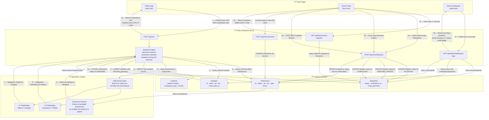

# Med Way — System Architecture

```mermaid
flowchart TD

    subgraph WEB["???  Web Pages"]
        PA["Patient App\nindex.html"]
        DP["Driver Portal\ndriver.html"]
        AD["Admin Dashboard\nadmin.html"]
    end

    subgraph API["??  Node.js Backend Server"]
        SOS_EP["POST /api/sos"]
        DISPATCH["Dispatch Engine\nHaversine nearest-ambulance selection\nHospital scoring and selection"]
        POLL_EP["GET /api/driver/active-dispatch"]
        LIFE_EP["POST /api/driver/lifecycle"]
        LOC_EP["POST /api/driver/location"]
        ADMIN_EP["GET /api/admin/dashboard-data"]
    end

    subgraph ALGO["??  Algorithmic Engine"]
        HAVER["Haversine Distance\nRanks all available ambulances\nby straight-line distance to patient"]
        OSM["OSM Road Graph\nBuilt from noida.osm\n145 MB real road network"]
        ASTAR1["A* Pathfinding\nAmbulance ? Patient"]
        ASTAR2["A* Pathfinding\nPatient ? Hospital"]
    end

    subgraph DB["???  SQLite Database"]
        AMB["ambulances\nid · status · lat · lon · type · driver"]
        HOSP["hospitals\nid · name · lat · lon · road_node_id"]
        INC["incidents\npatient location · emergency_type · priority"]
        DISP["dispatches\nstatus · ambulance_id · route_geometry"]
    end

    PA -->|"1 — Patient clicks SOS\nGPS coordinates sent"| SOS_EP
    SOS_EP --> DISPATCH

    DISPATCH -->|"2 — Query all AVAILABLE ambulances"| AMB
    AMB -->|"Returns full fleet list"| HAVER
    HAVER -->|"3 — Nearest ambulance identified"| DISPATCH

    DISPATCH -->|"4 — Query nearest hospital"| HOSP
    HOSP -->|"Returns best hospital match"| DISPATCH

    DISPATCH -->|"5 — Snap coordinates to road nodes"| OSM
    OSM --> ASTAR1
    OSM --> ASTAR2
    ASTAR1 -->|"6 — Waypoints: Ambulance to Patient"| DISPATCH
    ASTAR2 -->|"7 — Waypoints: Patient to Hospital"| DISPATCH

    DISPATCH -->|"8 — INSERT new incident record"| INC
    DISPATCH -->|"9 — INSERT dispatch with full route_geometry"| DISP
    DISPATCH -->|"10 — UPDATE ambulance status to ASSIGNED"| AMB

    SOS_EP -->|"11 — Returns ambulance info,\nhospital name, ETA, A* route"| PA

    DP -->|"12 — Polls every 5 seconds"| POLL_EP
    POLL_EP -->|"Query dispatch assigned to this driver"| DISP
    POLL_EP -->|"13 — Returns dispatch details and A* route"| DP

    DP -->|"14 — Driver taps Accept Emergency"| LIFE_EP
    LIFE_EP -->|"UPDATE dispatch status to ACCEPTED"| DISP

    DP -->|"15 — Driver taps Reached Patient"| LIFE_EP
    LIFE_EP -->|"UPDATE dispatch status to REACHED_PATIENT"| DISP

    DP -->|"16 — Driver taps Complete Mission"| LIFE_EP
    LIFE_EP -->|"UPDATE dispatch status to COMPLETED"| DISP
    LIFE_EP -->|"UPDATE ambulance status back to AVAILABLE"| AMB

    DP -->|"Location ping on each poll cycle"| LOC_EP
    LOC_EP -->|"UPDATE ambulance lat and lon"| AMB

    AD -->|"17 — Polls every 3 seconds"| ADMIN_EP
    ADMIN_EP -->|"Query all ambulances"| AMB
    ADMIN_EP -->|"Query active and completed dispatches"| DISP
    ADMIN_EP -->|"Query all hospitals"| HOSP
    ADMIN_EP -->|"18 — Returns live fleet positions,\nactive missions, A* routes, audit ledger"| AD
```
